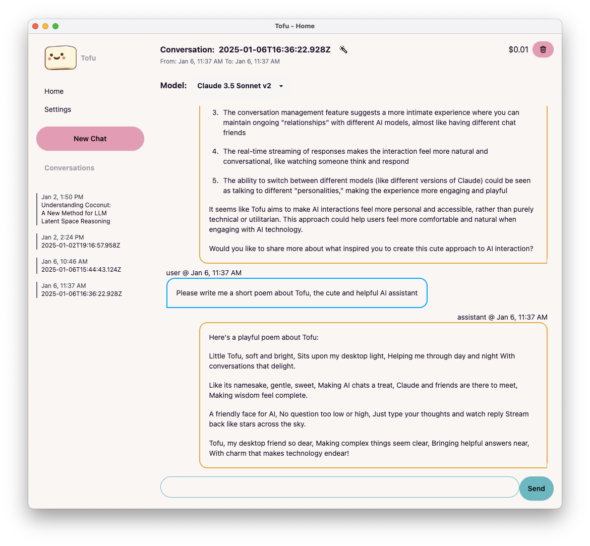

#  Tofu: An Electron-based AI Chat Application



Tofu is a desktop application built with Electron that provides an interface for interacting with AI models through Amazon Bedrock. It offers a user-friendly chat experience with support for multiple AI models.

## Project Description

Tofu is designed to facilitate conversations with AI models using Amazon's Bedrock service. The application allows users to select from different AI models, and engage in chat-like interactions. 

Key features of Tofu include:
- Integration with Amazon Bedrock for AI model access
- Support for multiple AI models, including Claude, Nova, and DeepSeek
- Real-time streaming of AI responses
- Conversation management with drag-and-drop reordering
- Markdown support in messages with syntax highlighting
- Code blocks with copy functionality
- Dark mode support with customizable themes
- Export conversations to JSON or Markdown
- System prompt customization
- Token usage tracking and cost calculation
- Obsidian vault integration for loading document content
- Cross-platform compatibility (Windows, macOS, Linux)

The application is built using Electron, React, and TypeScript, providing a robust and maintainable codebase. It leverages Electron Forge for building and packaging, ensuring a streamlined development and distribution process.

## Usage Instructions

### Installation

Prerequisites:
- Node.js (v14 or later)
- npm (v6 or later)
- AWS account with Bedrock access

Steps:
1. Clone the repository
2. Run `npm install` to install dependencies
3. Ensure you have the AWS CLI setup such that `aws configure export-credentials` returns a JSON with `AccessKeyId` and `SecretAccessKey` - this is how Tofu will talk with AWS Bedrock. You can set this up by following [this guide](https://docs.aws.amazon.com/cli/latest/userguide/getting-started-quickstart.html), or by running `aws configure`. Alternately, you can ensure you have a file `~/.aws/credentials` with the following data in it:
   ```
   aws_access_key_id=YOUR_ACCESS_KEY
   aws_secret_access_key=YOUR_SECRET_KEY
   ```

### Getting Started

To start the application in development mode:

```bash
npm run dev
```

To build the application for production:

```bash
npm run build
```

### Configuration

The application can be configured through the Settings page, where you can:
- Set your display name
- Choose light and dark mode themes
- Configure the system prompt
- Set your Obsidian vault path for document integration
- Reset application data if needed

### Common Use Cases

1. Starting a new conversation:
   - Click the "New Chat" button in the sidebar
   - Select an AI model from the dropdown
   - Type your message in the chat input and press Enter

2. Managing conversations:
   - Drag and drop conversations in the sidebar to reorder them
   - Click the title of a conversation to rename it
   - Use the auto-generate title button to create a title based on conversation content
   - Export conversations to JSON or Markdown format
   - Delete conversations using the delete button

3. Using Obsidian integration:
   - Set your Obsidian vault path in Settings
   - Use `!!load filename` in your messages to include content from your vault

4. Working with code:
   - Code blocks are automatically formatted with syntax highlighting
   - Copy buttons are available for both code blocks and entire messages
   - Multi-line code blocks are distinguished from inline code for better readability

5. Pasting content:
   - Rich text pasting is supported with automatic conversion to markdown
   - Images are automatically filtered from pastes to maintain text-based interactions

Note: The application uses a secure preload script to handle AWS credentials and Obsidian vault access